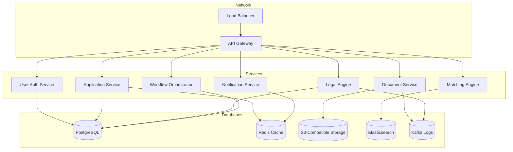
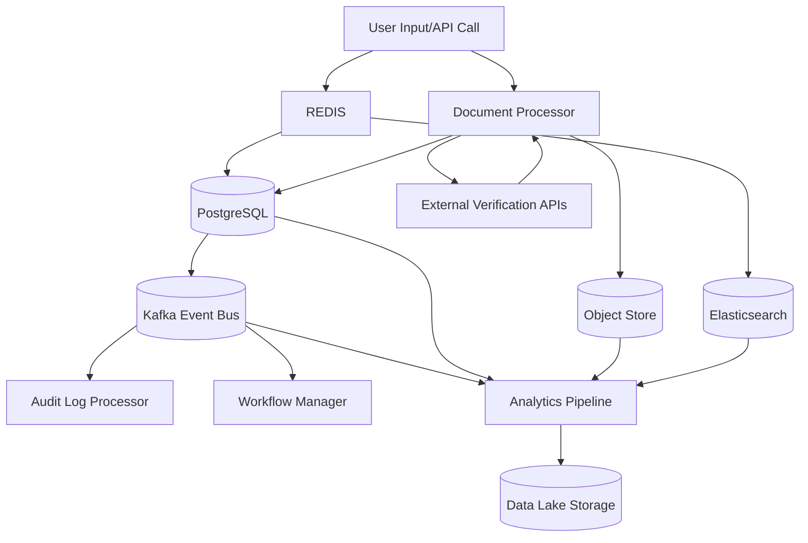
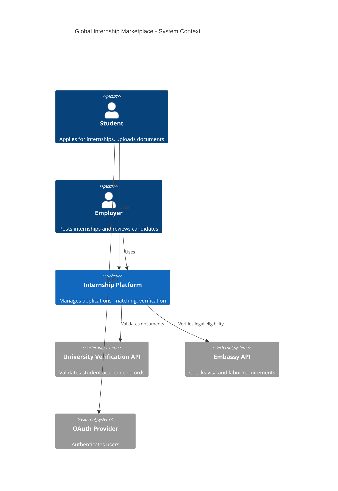
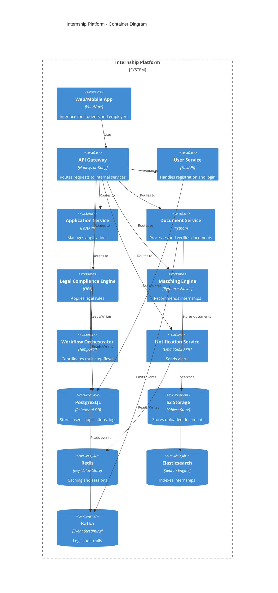

# Global Internship Marketplace – System Design Report

## 1. Project Goal

Design a globally distributed system that connects international students with internship opportunities across borders. The system must handle applications, verify documents, ensure legal compliance (visa/work rules), and match candidates with opportunities.

---

## Functional requirements

- Users can register, log in, and create profiles
- Employers can post internships
- Students apply to internships
- Documents are uploaded and verified
- Applications are legally checked
- Real-time status updates and notifications

### Non-Functional:
- Support 10,000+ concurrent users
- Response time < 300ms for search and matching
- 99.9% uptime availability
- End-to-end data encryption
- GDPR and global data regulation compliance

## 2. Non-Functional Requirements

### Business metrics:
- Support 10,000+ concurrent users
- Response time < 300ms for search and matching
- 99.9% uptime availability
- End-to-end data encryption
- GDPR and global data regulation compliance

| Category             | Requirement                                      | Justification                                                                 |
|----------------------|--------------------------------------------------|------------------------------------------------------------------------------|
| Accuracy             | High data integrity                              | Errors in legal documents could block international opportunities.          |
| Compliance           | Regulatory compliance (GDPR, HIPAA, etc.)        | Required for legal operation across different countries.                     |
| Consistency          | Strong consistency for critical workflows        | Ensures correctness of application and document states.                      |
| Scalability          | Horizontal scaling support                       | To handle global user base, especially during peak cycles.                   |
| Availability         | ≥99.9% uptime                                    | Required for global users in all time zones.                                 |
| Security & Privacy   | End-to-end encryption and consent control        | Sensitive user documents must remain private and safe.                       |
| Auditability         | Immutable logs for legal activity                | Required for dispute handling and compliance reviews.                        |
| Adaptability         | Country-specific ruleset updates without downtime| Legal requirements change frequently.                                        |
| Localization         | Multilingual UI and content                      | Accessible for users in 100+ countries.                                      |
| Latency              | Low-latency regional access                      | Ensures responsive user experience globally.                                 |
| Resilience           | Graceful degradation in failure                  | Local failures must not affect global availability.                          |
| Observability        | Monitoring, tracing, alerting                    | Ensures compliance and rapid troubleshooting.                                |

---

## 3. Problem Analysis

Key challenges include:
- Diverse legal regulations across jurisdictions
- Scalable and available infrastructure for global traffic
- Guaranteeing correctness and privacy of sensitive data
- Directing processes through legal verification channels
- Providing a responsive, secure user experience

---

## 4. System Components

### Core Software Services (Modular Monolith + External Engines)

- **User Service** – Registration, authentication (OAuth2), profile
- **Application Service** – Internship application submission & tracking
- **Matching Engine** – Scoring internships by profile and compliance
- **Document Service** – Upload, OCR validation, checksum, formatting
- **Verification Service** – Integration with embassies/universities
- **Legal Compliance Engine** – Policy-as-code regional compliance
- **Workflow Orchestrator** – Saga pattern coordinator for process steps
- **Notification Service** – Emails, SMS, system alerts
- **Admin & Analytics Portal** – Ops dashboard and reports
- **Audit Logger** – Legal-grade immutable activity records

---

## 5. Data Infrastructure

| Component          | Role                                                              |
|--------------------|-------------------------------------------------------------------|
| PostgreSQL         | Primary transactional store for users, applications, status logs |
| Redis              | Caching, token/session handling, rate-limiting                   |
| S3-Compatible Store| Document storage (CVs, passports, contracts)                     |
| Elasticsearch      | Indexing internships and users for rapid search                  |
| Kafka / Loki       | Event streaming and compliance logs                              |
| Data Lake          | Analytics, model training, historical archiving                  |

---

## 6. Data Flow Overview

1. **User Registration**  
   User → Auth Service → PostgreSQL (store) + Redis (token)  
   → Notification Service (email confirmation)

2. **Document Upload**  
   User → Document Service → S3 Storage + verification checks  
   → Verification Service → University/Embassy APIs

3. **Internship Application**  
   User → Application Service → PostgreSQL  
   → Legal Compliance Engine for jurisdictional checks  
   → Audit Logger logs results

4. **Matching Recommendations**  
   Matching Engine ← User profile + internship index (Elasticsearch)  
   → Ranked internship suggestions

5. **Orchestration & Logging**  
   Saga Manager → Triggers workflows and fallback/retry on failure  
   → Kafka logs all actions immutably

---

## 7. Architecture Pattern

### Adopted Pattern: Modular Monolith with Distributed Federated Services

- Internal services modularized but tightly integrated for strong consistency
- Stateless components enable horizontal scaling
- Distributed deployment for legal separation and performance
- External compliance and verification APIs integrated securely

---

## 8. C4 Model Diagrams (Mermaid-Based)

## 9. Tradeoffs

| Design Choice           | Reason                            | Trade-off                          |
|-------------------------|-----------------------------------|------------------------------------|
| Modular Monolith        | Central consistency & control     | Slower independent deployments     |
| SQL + Redis + S3        | Strong typing and search          | More services to manage            |
| OPA for rules           | Flexibility and auditability      | Slight latency in evaluation       |
| Region-based sharding   | Compliance, latency               | More infrastructure complexity     |
